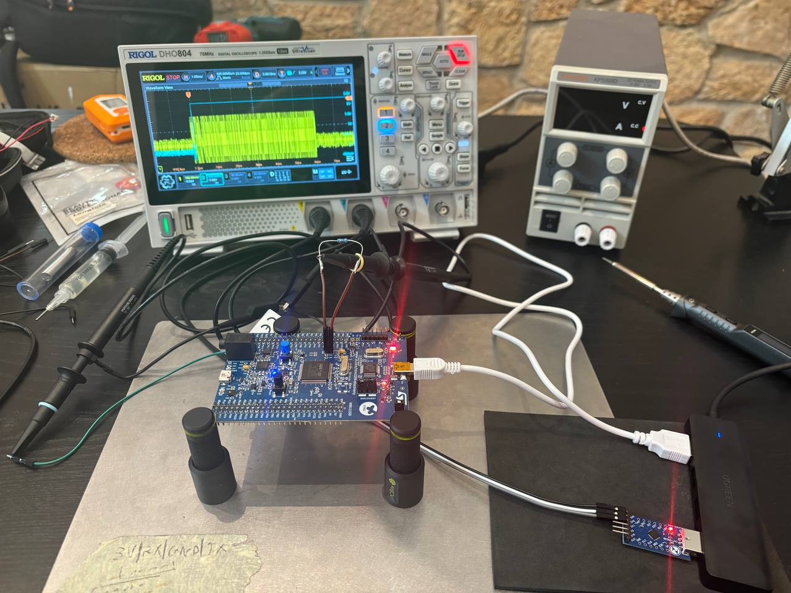

# Project for Progettazione di Sistemi Operativi

This is all the code and data used for the ECDH side-channel attack project.

## Structure
- `data/`: contains the data used for the attack and the capture and print scripts.
- `manuals`: are the relevant manuals for the board and scope.
- `tcl`: is the folder from `openocd` needed for uploading the code to the board.
- everything else is a standard CubeMX project with most code in `Core/Src/main.c`.
- `crypto.py` is a python reimplementation of the PRNG and ECC functions used to validate the C code.
- `old`: contains old code for 256-bit finite fields ECDH.

## Circuit

In order to comunicate with the board you need a CNT-003B USB to TTL adapter with
RX connected to pin PA2 and TX connected to pin PA3 (UART2). 
The scope Channel 1 will be connected to the pin after the 10 ohm shunt resistor
connected to the Idd jumper JP2, channel 2 will be connected to pin PD15 which
is the pin used to trigger the scope.



## Building
To build the project you need `cmake`, `ninja`, `arm-none-eabi-gcc`, `openocd`, and `tio`.
To have an enviornment ready to build the project you can use the nix shell `flake.nix`
which can be activated with `nix develop`.

```shell
mkdir build
cd build
cmake .. -GNinja -DCMAKE_BUILD_TYPE=Release
ninja
sudo openocd -f ../tcl/interface/stlink.cfg -f ../tcl/target/stm32f4x.cfg -c "program ./examnew.elf verify reset exit"
```

Then to connect to the board and see the output:

```shell
sudo tio -b 115200 /dev/ttyUSB0
```
